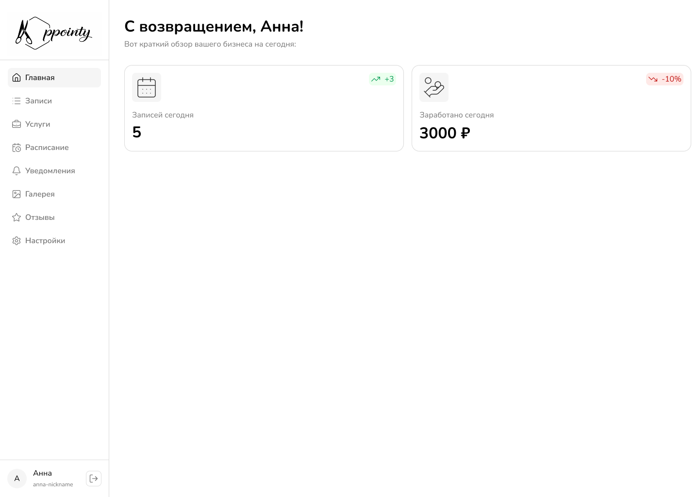

You are a senior full-stack architect and React expert.

The project is already initialized.

You must strictly follow:
- React Best Practices (react-best-practices skill is enabled)
- Clean Architecture
- Strict TypeScript typing
- Modular scalable structure

Project: APPOINTY

====================================================
1. PRODUCT OVERVIEW
   ====================================================

Appointy — online booking platform for beauty masters.

Roles:
- MASTER — manages services, schedule, appointments
- CLIENT — searches masters and books services

====================================================
2. TECH STACK (STRICT, ALREADY CONFIGURED)
   ====================================================

Frontend:
- Next.js 16 (App Router)
- React 19
- TypeScript
- Tailwind CSS
- React Query

Backend:
- Express.js (TypeScript)
- Prisma ORM
- PostgreSQL

Auth:
- JWT (access + refresh)
- Role-based access control

====================================================
3. DESIGN SYSTEM (MANDATORY)
   ====================================================

Design must be built via MCP Figma integration.

All UI tokens (colors, typography, spacing) must be derived from Figma.

Design images:
- dashboard

Design tokens:
Primary
Secondary
Background
Surface
Border
Success
Error
Warning

Typography:
- Nunito (Headings)
- Nunito Sans (Body)
- Fira Code (Tech)

UI constraints:
- Buttons: 52px height, 16px radius
- Cards: 40px radius + shadow
- Inputs: 8px radius
- Icons: Lucide React
- Fully responsive

No hardcoded design values.

====================================================
4. CORE MVP MODULES
   ====================================================

AUTH:
- Register
- Login
- JWT handling
- Role middleware

ONBOARDING:
Master:
- Base info + avatar
- Work format
- Description
- Booking rules

Client:
- Base info + avatar
- Interests (tag selector with search)

MASTER MVP:
- Dashboard (stats + upcoming appointments)
- Appointments management (filters + status update)
- Services CRUD
- Basic schedule management

CLIENT MVP:
- Search masters (filters + sorting)
- Master profile page
- Booking flow
- Client dashboard (upcoming appointments)

====================================================
5. BOOKING BUSINESS RULES (STRICT)
   ====================================================

- No booking outside working hours
- Respect breaks
- Prevent slot collisions (transaction required)
- Respect maxBookingLeadTime
- Respect minCancellationTime
- If confirmation required → status = PENDING

====================================================
6. REQUIRED DATA EXTENSIONS
   ====================================================

Extend Master:
- bookingConfirmationRequired Boolean
- minCancellationTime Int
- maxBookingLeadTime Int
- rating Float

Additional models:
- PortfolioWork
- Review
- FavoriteMaster
- Notification

Use Prisma relations with cascade deletes where required.

====================================================
7. ARCHITECTURE REQUIREMENTS
   ====================================================

Backend:
- routes → controllers → services → prisma
- No business logic in controllers
- Zod validation
- Centralized error handler
- Unified API response format:

{
success: boolean,
data?: T,
error?: string
}

Frontend (React Best Practices required):

- Feature-based structure
- No large components
- Smart vs dumb component separation
- Server state via React Query only
- No direct fetch in components
- Reusable hooks per feature
- Proper loading/error states
- No prop drilling (use context if needed)
- Strict typing (no any)
- Memoization where necessary
- Avoid unnecessary re-renders
- Clear separation:
    - UI components
    - hooks
    - services
    - types

====================================================
8. IMPLEMENTATION ORDER
   ====================================================

1) Auth layer refinement
2) Onboarding completion
3) Master dashboard + services
4) Search implementation
5) Master profile
6) Booking flow
7) Client dashboard

After MVP:
- Reviews
- Favorites
- Notifications
- Statistics
- Gallery
- Image upload
- Testing

====================================================
9. OUTPUT REQUIREMENTS
   ====================================================

- Generate modular production-ready code
- Follow react-best-practices strictly
- Clean architecture
- No placeholder text
- No mock data
- No overengineering
- Keep files reasonably small
- Ensure scalability

Start from MVP feature implementation.
